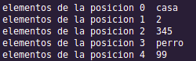

# TUPLAS
#
En este apartado vamos a  sobre los tipos de datos tuplas, que son un conjunto ordenado e inmutable de elementos, la diferencia con las listas reside en que las listas puedes manipular los elementos y en las tuplas no, es decir, no es posible añadir/eliminar elementos, modificarlos, etc al igual que las listas, las tuplas pueden contener elementos de diferentes tipos , por ejemplo una tupla puede estar compuesta por cadenas de texto, por numeros enteros , etc.

las tuplas en python se representan por una serie de elementos separados por comas y delimitados entre parentesis. Veamos un ejemplo de tuplas `("casa","2",345,"perro",99)`

la tupla estaria compuesta por cinco elementos, las cadenas de texto "casa", "2" y "pero" y los numeros enteros 345 y 99 

Al igual que en las listas, los elementos de las tuplas ocupan posiciones concretas, y mediante esa posicion que ocupan podemos acceder directamente a los elementos. En la siguiente tabla te mostramos la relacion de cada elemento con la posicion que ocupa en la tupla

|elemento|posicion|
|--------|--------|
|"casa"|0|
|"2"|1|
|345|2
|"perro"|3|
|99|4|
|

Tanto en laas listas como en las tuplas, los elementos empiezan por la posicion 0, no por la 1 como pareceria lo obvio. tenlo en cuenta cuando utilizes tuplas.

en el siguiente ejercicio vamos a ver como definir una tupla y como ecceder a sus elementos. El codigo fuente es el siguiente

la siguiente imagen muestra un ejemplo de ejecucion del codigo fuente 
#

